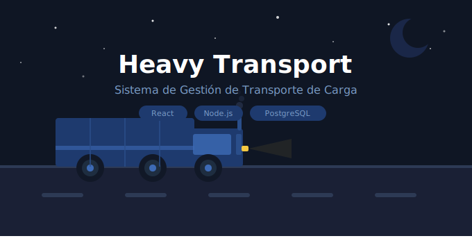

# Sistema de Gestión de Transporte de Carga




## 🌐 Demo en producción

**Frontend:** https://sistema-de-gestion-de-transporte-6g.vercel.app
**Backend API:** https://inspiring-friendship-production-b55f.up.railway.app

---

## 📌 Descripción del proyecto

Sistema web para la **gestión de viajes, gastos y vehículos** de una empresa familiar dedicada al transporte de carga pesada. Centraliza la información operativa en una base de datos, facilitando el registro, consulta y análisis de las operaciones.

---

## 🎯 Objetivos

### Objetivo general
Desarrollar una aplicación que permita **gestionar de forma digital los viajes, gastos y vehículos** de una empresa de transporte.

### Objetivos específicos
- Registrar viajes con todos los datos operativos y de facturación
- Registrar gastos asociados a viajes, vehículos, o sin asociación (repuestos)
- Consultar el historial de operaciones con filtros
- Calcular automáticamente ingresos, gastos y ganancias
- Gestionar vehículos, empleados y clientes con soft delete
- Generar reportes básicos desde el dashboard

---

## 💻 Tecnologías utilizadas

| Capa | Tecnología |
|------|-----------|
| Frontend | React 18 + React Router + Axios |
| Backend | Node.js v24 + Express |
| Base de datos | PostgreSQL 16 |
| Hosting Frontend | Vercel |
| Hosting Backend | Railway |
| Autenticación | JWT + bcrypt |
| Entorno de desarrollo | Ubuntu WSL2 en Windows |

---

## 🏗️ Arquitectura del sistema

```
Frontend React (Vercel)
│  axios + JWT interceptors
│
Backend Express API (Railway)
│  controllers → routes → middleware
│
PostgreSQL (Railway)
│  triggers + índices
```

---

## 🚀 Setup local (instalación desde cero)

### Requisitos previos
- Windows con WSL2 habilitado
- Ubuntu instalado desde Microsoft Store
- Docker Desktop con integración WSL2 activada para Ubuntu
- Node.js v24 instalado en Ubuntu
- VS Code con extensión Remote WSL

### 1. Levantar la base de datos

```bash
docker run --name heavy-transport-db \
  -e POSTGRES_PASSWORD=TU_PASSWORD \
  -e POSTGRES_DB=heavy_transport \
  -p 5432:5432 \
  -v heavy_transport_data:/var/lib/postgresql/data \
  -d postgres:16

sudo apt install postgresql-client -y

psql -h localhost -U postgres \
  -f ~/proyectos/heavy-transport/database/HeavyTransport.sql
```

### 2. Configurar el backend

```bash
cd ~/proyectos/heavy-transport/backend
npm install
```

Crear archivo `.env`:
```env
DB_HOST=localhost
DB_PORT=5432
DB_NAME=heavy_transport
DB_USER=postgres
DB_PASSWORD=TU_PASSWORD
PORT=3000
OWNER_ID=1
JWT_SECRET=heavy_transport_secret_local_2024
FRONTEND_URL=http://localhost:3001
```

Configurar contraseña del admin (solo la primera vez):
```bash
curl -X POST http://localhost:3000/api/auth/setup-password \
  -H "Content-Type: application/json" \
  -d '{"password":"TU_PASSWORD_ADMIN"}'
```

Iniciar el backend:
```bash
npm run dev
```

### 3. Configurar el frontend

```bash
cd ~/proyectos/heavy-transport/frontend
npm install --legacy-peer-deps
echo "PORT=3001" > .env
echo "REACT_APP_API_URL=http://localhost:3000/api" >> .env
npm start
```

Acceder en: `http://localhost:3001`

---

## ☁️ Despliegue en producción

### Variables de entorno en Railway (backend)
```
DATABASE_URL=<generada automáticamente por Railway>
JWT_SECRET=<secreto seguro>
OWNER_ID=1
NODE_ENV=production
FRONTEND_URL=https://tu-app.vercel.app
```

### Variables de entorno en Vercel (frontend)
```
REACT_APP_API_URL=https://tu-backend.up.railway.app/api
CI=false
```

### Actualizar el sistema en producción
```bash
git add .
git commit -m "Descripción del cambio"
git push
```
Railway y Vercel despliegan automáticamente al detectar el push.

---

## 📁 Estructura del proyecto

```
heavy-transport/
├── database/
│   └── HeavyTransport.sql
├── backend/
│   ├── config/
│   │   └── db.js
│   ├── controllers/
│   │   ├── authController.js
│   │   ├── vehicleController.js
│   │   ├── employeeController.js
│   │   ├── clientController.js
│   │   ├── tripController.js
│   │   └── expenseController.js
│   ├── middleware/
│   │   └── auth.js
│   ├── routes/
│   │   ├── authRoutes.js
│   │   ├── vehicleRoutes.js
│   │   ├── employeeRoutes.js
│   │   ├── clientRoutes.js
│   │   ├── tripRoutes.js
│   │   └── expenseRoutes.js
│   ├── app.js
│   └── .env
└── frontend/
    └── src/
        ├── pages/
        │   ├── Login.js
        │   ├── Dashboard.js
        │   ├── Vehicles.js
        │   ├── Employees.js
        │   ├── Clients.js
        │   ├── Trips.js
        │   └── Expenses.js
        ├── services/
        │   └── api.js
        ├── styles/
        │   └── common.js
        └── App.js
```

---

## ⚙️ Funcionalidades implementadas

### Autenticación
- Login con usuario y contraseña
- Token JWT con expiración de 8 horas
- Redirección automática al login cuando el token expira

### Dashboard
- Filtros por semana, mes, año y período personalizado
- Total de viajes, ingresos, gastos y ganancia del período
- Tabla de los últimos 5 viajes del período

### Viajes
- Registro completo: fecha, vehículo, conductor, cliente, origen, destino
- Campos de contenedor: número de contenedor, DUA, tamaño del equipo, peso
- Tipo de operación: importación, exportación, nacional
- Número de factura y descripción
- Estado del flujo de facturación
- Filtros por fecha, vehículo y cliente
- Búsqueda por número de contenedor
- Cálculo automático de gastos totales y ganancia

### Gastos
- Tipos: combustible, peajes, mantenimiento, reparaciones, otro
- Asociación opcional a viaje o vehículo
- Gastos sin asociación permitidos (repuestos de bodega)
- Filtros por viaje y vehículo

### Vehículos, Empleados y Clientes
- CRUD completo
- Soft delete — desactivar y reactivar sin perder datos

---

## 🔄 Comandos de inicio diario (entorno local)

```bash
docker start heavy-transport-db
cd ~/proyectos/heavy-transport/backend && npm run dev
cd ~/proyectos/heavy-transport/frontend && npm start
```

---

## 📈 Plan de mejoras futuras

- Gráficos de ingresos y gastos por mes
- Facturación electrónica con Ministerio de Hacienda
- Exportación a Excel y PDF
- Control de mantenimiento de vehículos
- Multiusuario con roles
- Notificaciones de vencimiento de revisión técnica

---

## 📚 Propósito académico

Proyecto personal de formación en Ingeniería Informática, aplicando conocimientos en diseño de bases de datos, desarrollo web full-stack, arquitectura de software y digitalización de procesos reales.
